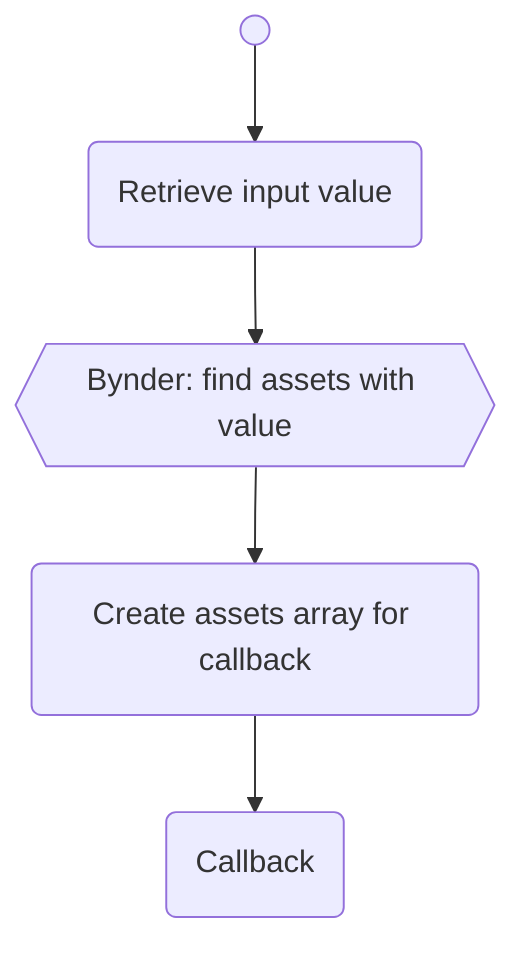
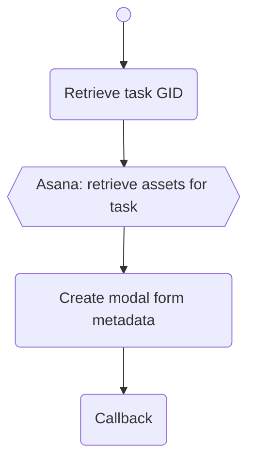
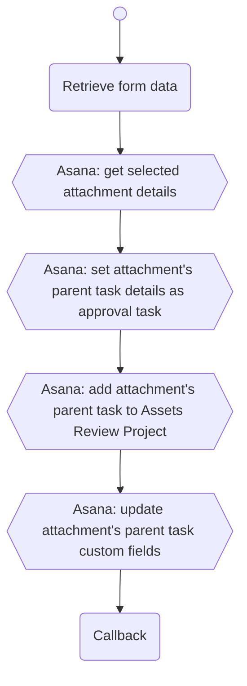

# Asana AppComponent DAM showcase

## Objective

Showcase a number of workflows that integrate Asana with a Digital Asset Management tool. 

We will be using Asana's [AppComponents](https://blog.asana.com/2022/03/app-components/) and [Rules](https://asana.com/guide/help/premium/rules).

For the DAM, we will be using [Bynder](https://www.bynder.com).

These set of APIs were developed with [Vercel's Serverless Functions](https://vercel.com/docs/concepts/functions/serverless-functions).

## Workflows

### 1. Search for and attach an asset from Bynder

Search for an asset from Bynder in Asana and display it as an AppComponent widget.

#### References

- [AppComponent Widget](https://developers.asana.com/docs/widgets)
- [AppComponent Lookup Attach resource](https://developers.asana.com/docs/attach-resource)
- [AppComponent Lookup Typeahead results](https://developers.asana.com/docs/get-lookup-typeahead-results)
- Bynder API

#### Flow diagram

The user introduces the search pattern in the AppComponent input field, which trigger the following workflow:



### 2. Approve an asset in Asana and save it in Bynder

Submit an existing attachment in a task for review. If approved, upload the asset to Bynder.

#### References

- [AppComponent Widget](https://developers.asana.com/docs/widgets)
- [AppComponent Modal forms](https://developers.asana.com/docs/modal-forms)
- [AppComponent Lookup Typeahead results](https://developers.asana.com/docs/get-lookup-typeahead-results)
- Bynder API

#### Flow diagram

Present modal form:



After submitting the modal form:




## Deployment

This is a [Next.js](https://nextjs.org/) project bootstrapped with [`create-next-app`](https://github.com/vercel/next.js/tree/canary/packages/create-next-app).

### Getting Started

Install dependencies and run the development server:

```bash
npm install
# then
npm run dev
# or
yarn dev
```

Open [http://localhost:3000](http://localhost:3000) with your browser to see the result.

[API routes](https://nextjs.org/docs/api-routes/introduction) can be accessed on [http://localhost:3000/api/xyz](http://localhost:3000/api/zyx). See all available endpoints in the `pages/api/` directory.

### Add Env variables

Create a `.env` file in the root folder with the following environment variables:

```yaml
BYNDER_TOKEN="" # Bynder PAT Token
BYNDER_URL="" # Base URL for specific Bynder domain
VERCEL_URL="" # Base URL for where the Vercel app is deployed
ASANA_TOKEN="" # Asana PAT Token
ASANA_PROJECT_DAM_ASSETS_REVIEW="" # Asana Project for Assets Review
ASANA_PROJECT_DAM_ASSETS_REVIEW_CF_TEAM="" # Asana Custom Field Team GID
ASANA_PROJECT_DAM_ASSETS_REVIEW_CF_TEAM_MARKETING="" # Asana Custom Field Team Marketing Value
ASANA_PROJECT_DAM_ASSETS_REVIEW_CF_TEAM_SALES="" # Asana Custom Field Team Sales Value
ASANA_PROJECT_DAM_ASSETS_REVIEW_CF_TEAM_DESIGN="" # Asana Custom Field Team Design Value
ASANA_PROJECT_DAM_ASSETS_REVIEW_CF_NAME="" # Asana Custom Field Asset Name Value
ASANA_PROJECT_DAM_ASSETS_REVIEW_CF_DESCRIPTION="" # Asana Custom Field Asset Description Value
ASANA_PROJECT_DAM_ASSETS_REVIEW_CF_GID="" # Asana Custom Field Attachment GID Value
```

These environment values [have to be declared in Vercel too](https://vercel.com/docs/concepts/projects/environment-variables).

### Next.js Configuration

In order to prevent `CORS` errors, the following has been added to `next.config.js`:

```ts
headers: async () => {
    return [
      {
        // matching all API routes
        source: "/api/:path*",
        headers: [
          { key: "Access-Control-Allow-Credentials", value: "true" },
          { key: "Access-Control-Allow-Origin", value: "*" },
          { key: "Access-Control-Allow-Methods", value: "GET,OPTIONS,PATCH,DELETE,POST,PUT" },
          { key: "Access-Control-Allow-Headers", value: "X-CSRF-Token, X-Requested-With, Accept, Accept-Version, Content-Length, Content-MD5, Content-Type, Date, X-Api-Version, X-Asana-Request-Signature" },
        ]
      }
    ]
  }
```

### Deploy on Vercel

The easiest way to deploy your Next.js app is to use the [Vercel Platform](https://vercel.com/new?utm_medium=default-template&filter=next.js&utm_source=create-next-app&utm_campaign=create-next-app-readme) from the creators of Next.js.

Check out our [Next.js deployment documentation](https://nextjs.org/docs/deployment) for more details.
